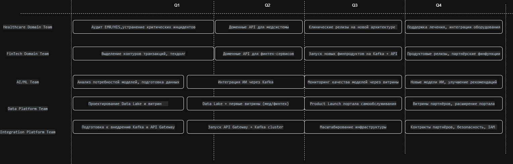

## Команды:

| Команда                       | Зона ответственности                        |
|-------------------------------|---------------------------------------------|
| **Healthcare Domain Team**    | клиники, EMR/HIS, медданные                 |
| **FinTech Domain Team**       | финоперации, платежи, кредиты, регуляторика |
| **AI/ML Team**                | ИИ-модели, поддержка врачей, MLOps          |
| **Data Platform Team**        | Data Lake, витрины, портал самообслуживания |
| **Integration Platform Team** | Kafka, API Gateway, партнёры                |

# Q1

## Цель: подготовить фундамент для независимых доменов и платформы данных; снизить инциденты в медицине и финтехе.

| Команда                   | Этап                                             | Результат                                           | Ресурсы                |
|---------------------------|--------------------------------------------------|-----------------------------------------------------|------------------------|
| Healthcare Domain Team    | Аудит EMR/HIS, устранение критических инцидентов | Повышение стабильности клиник                       | 5 dev + 1 SRE          |
| FinTech Domain Team       | Выделение контуров транзакций, техдолг           | Стабильность финопераций, подготовка к доменным API | 6 dev + QA             |
| AI/ML Team                | Анализ потребностей моделей, подготовка данных   | Готовность к интеграции ИИ через события            | 2 ML Eng               |
| Data Platform Team        | Проектирование Data Lake и витрин                | Архитектура платформы данных утверждена             | Data Architect, 2 DE   |
| Integration Platform Team | Подготовка к внедрению Kafka и API Gateway       | План доменных контрактов и событий                  | 2 integrators + DevOps |

# Q2

## Цель: запустить API Gateway + Kafka; построить MVP портала и первые витрины; обеспечить независимость данных доменов.

| Команда                   | Этап                                    | Результат                                     | Ресурсы            |
|---------------------------|-----------------------------------------|-----------------------------------------------|--------------------|
| Healthcare Domain Team    | Доменные API для медсистемы             | Клиники независимы от DWH                     | 4 backend          |
| FinTech Domain Team       | Доменные API для финтех-сервисов        | Финтех переходит на событийную архитектуру    | 4 backend          |
| AI/ML Team                | Интеграция ИИ через Kafka               | Результаты ИИ доступны аналитике и медсистеме | ML Eng + Data Eng  |
| Data Platform Team        | Data Lake + первые витрины (мед/финтех) | Основа портала самообслуживания               | 3 DE + 1 architect |
| Integration Platform Team | Запуск API Gateway + Kafka cluster      | Единый вход для API и событий между доменами  | DevOps + Security  |

# Q3

## Цель: продуктовый запуск портала самообслуживания; масштабирование платформы данных; доменные продуктовые релизы.

| Команда                   | Этап                                      | Результат                                          | Ресурсы           |
|---------------------------|-------------------------------------------|----------------------------------------------------|-------------------|
| Healthcare Domain Team    | Клинические релизы на новой архитектуре   | Быстрее вывод медицинских функций, выше надёжность | domain team       |
| FinTech Domain Team       | Запуск новых финпродуктов на Kafka + API  | Независимое развитие финтеха                       | domain team       |
| AI/ML Team                | Мониторинг качества моделей через витрины | Прозрачность влияния ИИ на медпоказатели           | ML Eng + Data Eng |
| Data Platform Team        | Product Launch портала самообслуживания   | Руководство и домены строят отчёты сами            | FE/BE/DE          |
| Integration Platform Team | Масштабирование инфраструктуры            | SLA, отказоустойчивость, нагрузка                  | Cloud/SRE         |

---

# Q4

## Цель: стабильность, подключение партнёров, расширение витрин, рост экосистемы.

| Команда                   | Этап                                       | Результат                                           |
|---------------------------|--------------------------------------------|-----------------------------------------------------|
| Healthcare Domain Team    | Поддержка лечения, интеграции оборудования | Качество услуг, стабильность клиник                 |
| FinTech Domain Team       | Продуктовые релизы, партнёрские финфункции | Рост выручки, банковские SLA                        |
| AI/ML Team                | Новые модели ИИ, улучшение рекомендаций    | Улучшение диагностики и скорости обслуживания       |
| Data Platform Team        | Витрины партнёров, расширение портала      | Аналитика фармы, оборудования, партнёров            |
| Integration Platform Team | Контракты партнёров, безопасность, IAM     | Подключение новых бизнесов без затрагивания доменов |

