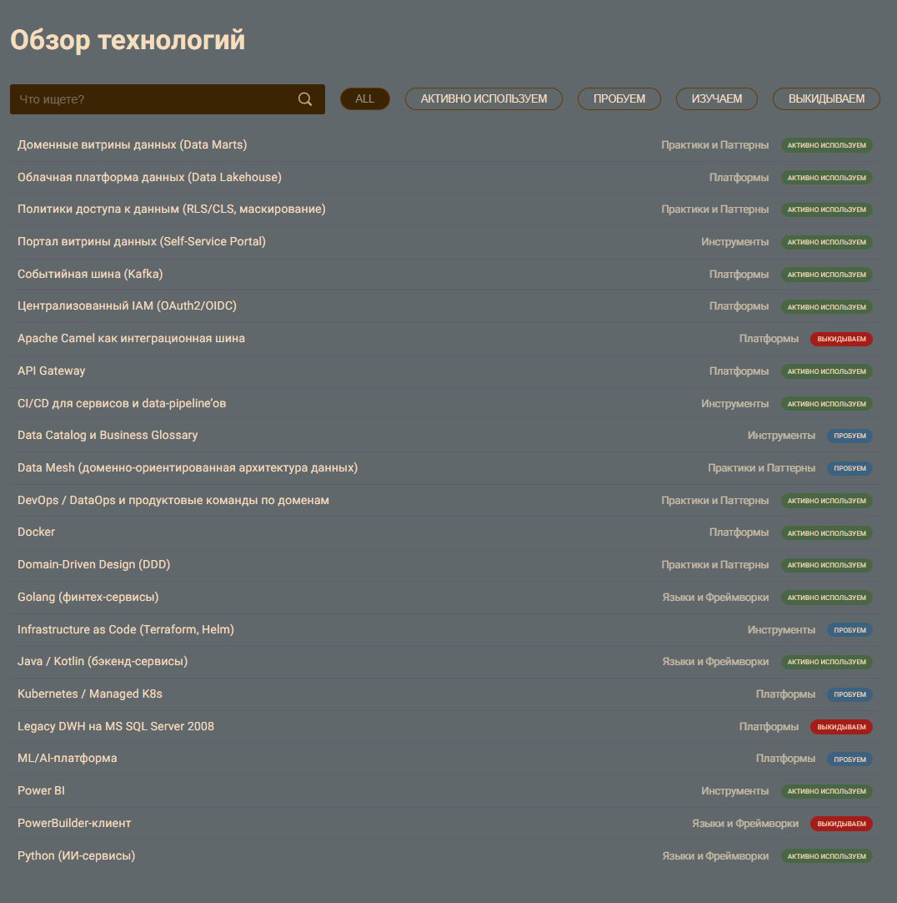

## 1. Data & Analytics

| Технология / подход                                                        | Статус    | Текущее / новое                          | Какие бизнес-сценарии поддерживает                                                                                                                                           |
|----------------------------------------------------------------------------|-----------|------------------------------------------|------------------------------------------------------------------------------------------------------------------------------------------------------------------------------|
| **Платформа данных в облаке (Data Lake / Lakehouse на S3/Blob + MPP DWH)** | **Adopt** | **Новое**                                | • Быстрая подготовка отчётности (масштабируемые вычисления) • Сквозная аналитика по всем доменам без загрузки DWH • Поддержка роста объёмов данных (сотни ТБ и больше) |
| **Доменные витрины данных (data marts по доменам)**                        | **Adopt** | **Новое**                                | • Независимая аналитика по медицине, финтеху, партнёрам • Снижение нагрузки на операционные БД • Возможность быстро добавлять отчёты по новым продуктам                |
| **Портал витрины данных (self-service BI-портал)**                         | **Adopt** | **Новое**                                | • Самообслуживание аналитиков и менеджеров • Ускорение принятия управленческих решений • Снижение нагрузки на ИТ-команду («сделайте отчёт»)                            |
| **Power BI / аналогичный BI-инструмент**                                   | **Adopt** | **Текущее → перенос на новую платформу** | • Построение сложных дашбордов по медицине и финтеху • Регуляторная и управленческая отчётность                                                                           |
| **Легаси DWH на MS SQL Server 2008**                                       | **Hold**  | **Текущее**                              | • Временная поддержка существующей отчётности • Постепенный перенос отчётов в доменные витрины и облако                                                                   |
| **Data Catalog + Business Glossary (например, DataHub / Collibra)**        | **Trial** | **Новое**                                | • Прозрачность данных для бизнеса (какие наборы есть, кто владелец) • Управление доступом к мед/фин данным • Ускорение внедрения новых витрин и команд                 |
| **ML/AI платформа (обучение моделей, MLops)**                              | **Trial** | **Расширение текущих Python- сервисов**  | • Быстрое внедрение и обновление медицинских моделей ИИ • Трассировка качества моделей (метрики в витринах) • Поддержка экспериментов без влияния на продакшн          |

## 2. Integration & Architecture

| Технология / подход                                        | Статус    | Текущее / новое    | Бизнес-сценарии                                                                                                                                                               |
|------------------------------------------------------------|-----------|--------------------|-------------------------------------------------------------------------------------------------------------------------------------------------------------------------------|
| **Событийная шина / стриминг (Kafka / managed Kafka)**     | **Adopt** | **Новое**          | • Независимое развитие доменов (медицина, финтех, ИИ, партнёры) • Подключение новых финтех-сервисов без правки DWH • Потоки телеметрии от оборудования и результатов ИИ |
| **API Gateway (для внешних и внутренних API)**             | **Adopt** | **Новое**          | • Быстрое подключение новых партнёров и приложений • Централизованная безопасность и лимитирование трафика • Единая точка входа для портала и мобильных приложений      |
| **Apache Camel как основа шины интеграции**                | **Hold**  | **Текущее**        | • Поддержка существующих интеграций на переходный период • Постепенная миграция на событийную архитектуру                                                                  |
| **Data Mesh / доменно-ориентированная архитектура данных** | **Trial** | **Новое (подход)** | • Доменная ответственность команд за свои данные • Локальное развитие витрин и продуктов в домене • Масштабируемая интеграция новых направлений бизнеса                 |
| **Domain-Driven Design (DDD) для сервисов домена**         | **Adopt** | **Методология**    | • Чёткие границы между мед, финтех, ИИ доменами • Уменьшение связности и рисков изменений • Более прогнозируемое развитие архитектуры                                   |

## 3. Application

| Технология / подход                                   | Статус            | Текущее / новое                  | Бизнес-сценарии                                                                                                                                                       |
|-------------------------------------------------------|-------------------|----------------------------------|-----------------------------------------------------------------------------------------------------------------------------------------------------------------------|
| **Java / Kotlin (финтех, интеграция, часть бэкенда)** | **Adopt**         | **Текущее**                      | • Развитие банковских продуктов и интеграционного слоя • Реализация бизнес-логики финтеха вне DWH                                                                  |
| **Golang (финтех-сервисы)**                           | **Adopt**         | **Текущее**                      | • Высоконагруженные платёжные и API-сервисы • Масштабируемые финтех-продукты                                                                                       |
| **Python (ИИ-сервисы)**                               | **Adopt**         | **Текущее**                      | • Разработка и развёртывание моделей диагностики • Быстрый экспериментальный контур для ИИ                                                                         |
| **PowerBuilder-клиент для операторов**                | **Hold**          | **Текущее**                      | • Временная поддержка существующих рабочих мест • Постепенная замена на веб-клиент медицинского домена                                                             |
| **Контейнеризация (Docker)**                          | **Adopt**         | **Частично текущее → расширяем** | • Упрощение деплоя микросервисов • Быстрое масштабирование под пиковые нагрузки (отчётность, ИИ, финтех)                                                           |
| **Kubernetes / managed K8s (в облаке)**               | **Trial → Adopt** | **Новое**                        | • Автоматическое масштабирование сервисов и ИИ-нагрузки • Высокая доступность критичных систем (банк, мед. ядро) • Единый способ развёртывания для всех доменов |

## 4. Security

| Технология / подход                                                           | Статус             | Текущее / новое                | Бизнес-сценарии                                                                                                                                                               |
|-------------------------------------------------------------------------------|--------------------|--------------------------------|-------------------------------------------------------------------------------------------------------------------------------------------------------------------------------|
| **Централизованный IAM (OAuth2/OIDC, роли, атрибуты)**                        | **Adopt**          | **Новое**                      | • Регулируемый доступ к мед/фин данным по доменам • Безопасный доступ к порталу и API • Соответствие требованиям регуляторов                                            |
| **Политики доступа к данным (row/column level security, data masking)**       | **Adopt**          | **Новое**                      | • Использование агрегированных данных без раскрытия медкарт • Безопасные витрины для финтех-аналитики • Возможность делиться данными с партнёрами                       |
| **CI/CD для микросервисов и data-pipeline’ов**                                | **Adopt**          | **Частично текущее → усилить** | • Быстрый и предсказуемый релиз новых финтех- и ИИ-функций • Регулярные обновления витрин и ETL без простоя • Сокращение ошибок при релизах                             |
| **Infrastructure as Code (Terraform, Helm и т. п.)**                          | **Trial**          | **Новое**                      | • Повторяемые среды для доменов (dev/test/prod) • Быстрый разворот новых окружений под партнёров и пилоты                                                                  |
| **Методологии: доменная команда (product team per domain), DevOps / DataOps** | **Adopt (подход)** | **Новое**                      | • Каждое направление (клиника, финтех, ИИ) развивается независимой командой • Быстрее проходят изменения от идеи до продакшена • Улучшается качество и скорость релизов |
 
